# FRP 统一管理平台

一套面向内网穿透运维场景的 FRP 集中管理平台。后端基于 Django REST Framework，
前端基于 Vue 3 + Vite + TypeScript，用于统一纳管 frps 服务端、frpc 客户端与端口隧道，
并提供准入审核、运行态同步、流量统计与全量操作审计。

- 默认访问地址：http://127.0.0.1:5173
- 默认账号：`admin` / `admin123`（仅限本地开发，生产环境请立即修改）

## 界面预览

平台默认采用 **天青白** 浅色主题，界面清爽、数据卡片与表格层次分明。截图已统一使用该主题并放在 `docs/images/` 目录下，可直接用于 README 与项目文档。

登录页：

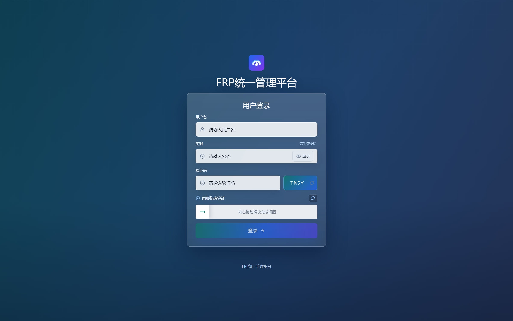

FRP 服务端与 frpc 客户端：

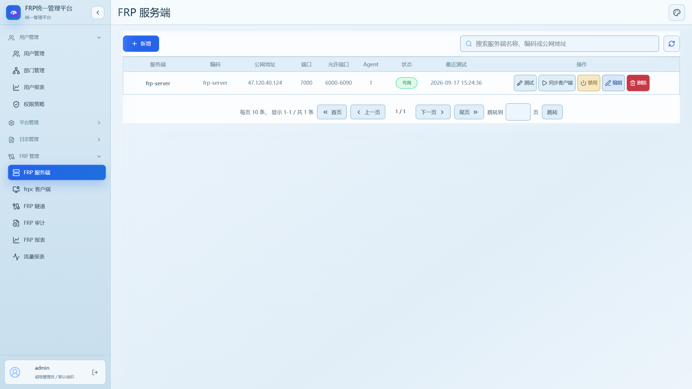

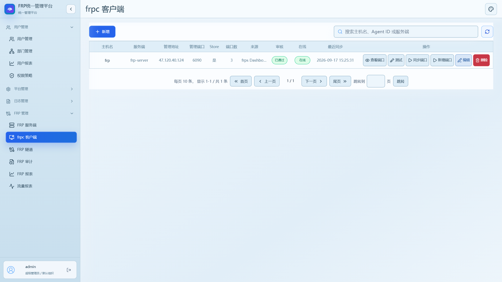

FRP 隧道配置与连接审计：

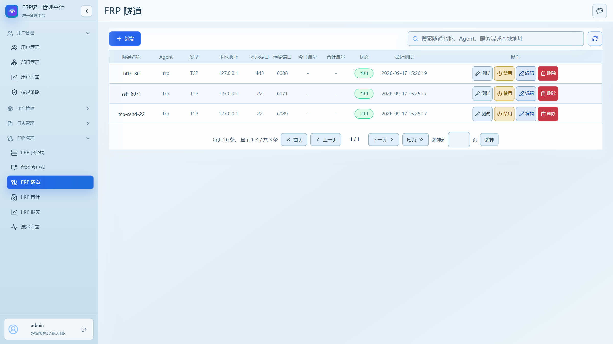

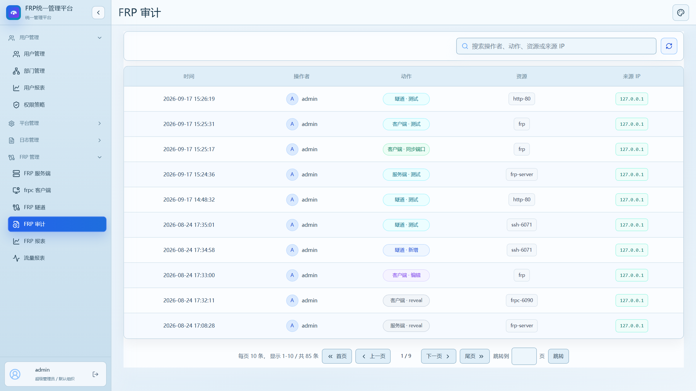

FRP 报表中心与流量报表：

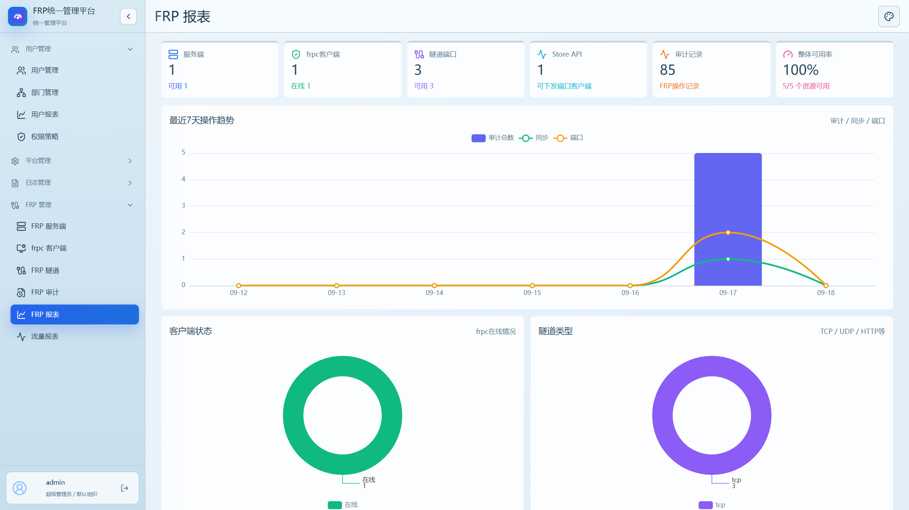

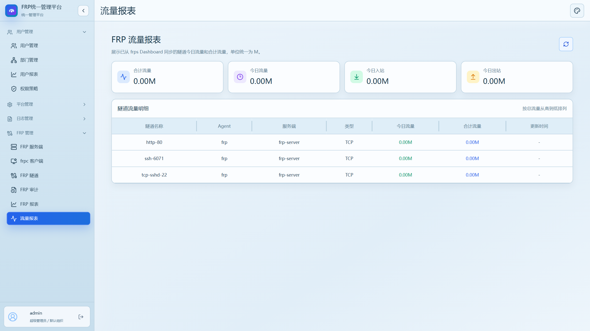

用户管理：

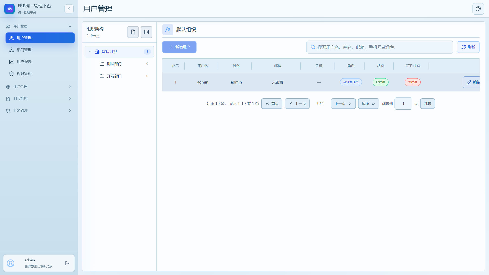

平台管理（平台设置）：

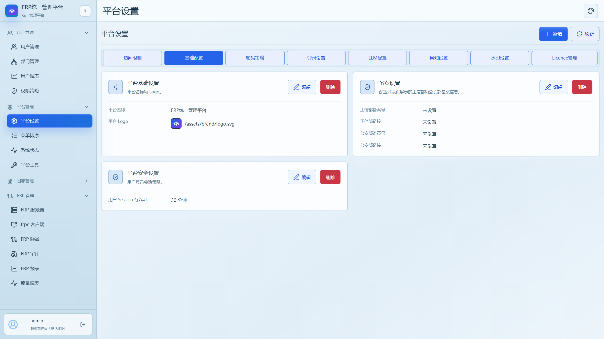

日志管理（用户日志与系统日志）：

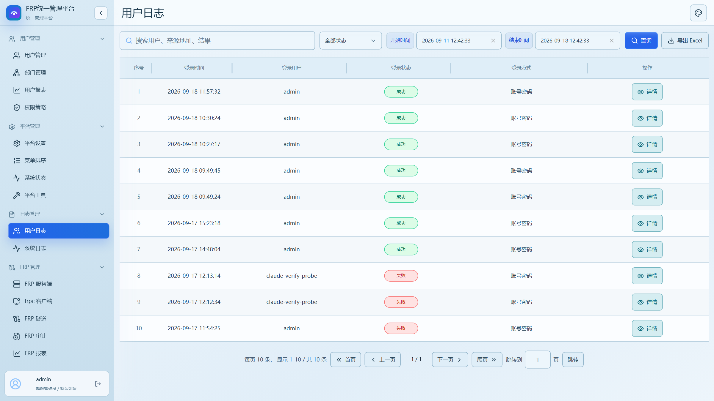

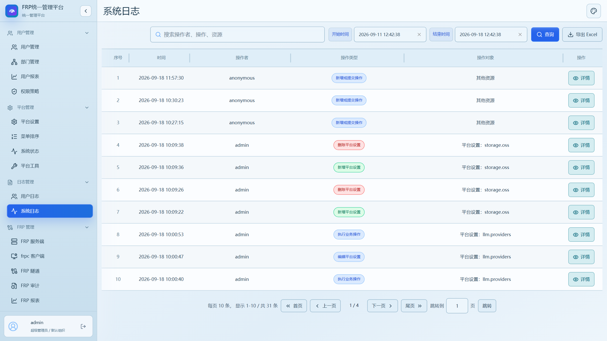

---

## 一、开发环境与版本

### 1.1 基础环境

| 项目 | 版本 | 说明 |
| --- | --- | --- |
| Python | 3.12（实测 3.12.10） | 后端运行时 |
| Node.js | ≥ 22（实测 v24.13.0） | 前端开发服务器与构建 |
| npm | ≥ 10（实测 11.6.2） | 前端包管理 |
| Django | 4.2 LTS | Web 框架 |
| 数据库 | SQLite 3 | 默认内置，开箱即用 |
| frp | 建议 v0.52.0+ | 被纳管的 frps / frpc |
| 浏览器 | Chrome / Edge 最新版 | 前端为 SPA 应用 |

### 1.2 后端依赖（`backend/requirements.txt`）

```
Django>=4.2,<5.0
django-cors-headers>=4.9,<5.0
djangorestframework>=3.17,<4.0
gmssl>=3.2.2,<4.0
openpyxl>=3.1,<4.0
psutil>=7.0,<8.0
PyJWT>=2.12,<3.0
requests>=2.33,<3.0
icmplib>=3.0,<4.0
```

### 1.3 前端依赖（`front/package.json`）

运行依赖：

- `vue` ^3.5.34、`vue-router` ^4.6.4、`pinia` ^3.0.4
- `echarts` ^6.1.0 — 报表图表渲染
- `html2canvas` ^1.4.1、`jspdf` ^4.2.1 — 报表导出
- `@vuepic/vue-datepicker` ^14.0.0、`date-fns` ^4.4.0 — 日期选择
- `lucide-vue-next` ^0.577.0 — 图标库
- `qrcode` ^1.5.4 — 二维码（OTP 绑定）

开发依赖：

- `vite` ^7.3.1、`@vitejs/plugin-vue` ^6.0.7
- `typescript` ^5.9.2、`vue-tsc` ^3.3.2
- `tailwindcss` ^4.1.13、`@tailwindcss/postcss` ^4.1.13、`postcss` ^8.5.6

---

## 二、技术架构

### 2.1 技术栈

| 层次 | 技术选型 |
| --- | --- |
| 后端框架 | Django 4.2 + Django REST Framework 3.17 |
| 数据库 | SQLite 3（通过 Django ORM 访问） |
| 身份认证 | JWT（PyJWT）+ 图形验证码 + 滑块验证，可选 OTP 二次验证 |
| 前端框架 | Vue 3 + TypeScript + Vite 7 |
| 状态管理 | Pinia |
| UI 样式 | Tailwind CSS 4 |
| 图表 / 导出 | ECharts 6、html2canvas、jsPDF |
| 加解密 | gmssl（国密 SM4，用于敏感配置落库加密） |
| 运维探测 | icmplib / psutil / requests（ping、telnet、curl、traceroute、mtr） |

### 2.2 目录结构

```
frpsys/
├── backend/                 # Django 后端
│   ├── backend/             # 项目配置：settings / urls / asgi / wsgi
│   ├── ops/                 # 平台基础能力：用户、组织、角色、权限、系统设置与系统工具
│   ├── identity/            # 身份认证相关实现（验证码、OTP、密码策略等）
│   ├── security_frp/        # FRP 管理核心模块：服务端、客户端、隧道、心跳、审计、报表
│   ├── data_security/       # 数据安全与国密加解密能力
│   ├── platform_logs/       # 用户操作日志与系统日志
│   ├── scripts/             # 运维脚本
│   ├── requirements.txt     # 后端依赖清单
│   └── manage.py            # Django 管理入口
├── front/                   # Vue 3 前端
│   ├── src/                 # 源码：views / components / stores / utils / styles
│   ├── package.json         # 前端依赖与脚本
│   └── vite.config.ts       # Vite 配置（含开发代理）
└── docs/images/             # README 截图资源
```

---

## 三、功能模块

平台左侧菜单分为 **用户管理、平台管理、日志管理、FRP 管理** 四大板块，权限均通过「权限策略」细粒度控制。

### 3.1 用户管理

- **用户管理**：维护平台账号、角色与所属部门，支持启用 / 禁用、重置密码、OTP 二次验证绑定；密码策略（长度、复杂度、有效期）由平台统一配置并生效。
- **部门管理**：维护组织架构与层级关系，支持部门成员归属调整；兼容「组织管理」与「部门管理」两种视图。
- **权限策略**：基于 RBAC 的权限策略与规则管理，可按页面、操作（增删改查、导出、审核等）为不同角色授权，支持策略克隆与批量调整。
- **用户报表**：按部门、时间维度统计用户登录与操作情况，支持报表生成与导出。


### 3.2 平台管理

- **平台设置**：平台名称、Logo、备案信息、访问白名单、密码策略、登录策略（验证码 / 滑块 / OTP）、LLM 配置、通知渠道、水印、License 等一站式配置。
- **系统状态**：展示后端运行状态、资源占用、服务健康度等关键指标。
- **平台工具**：内置 Ping、Telnet、Curl、Traceroute、MTR 等常用网络运维探测工具，便于排查 FRP 链路连通性。
- **菜单顺序**：管理员可拖拽调整个人或系统默认的左侧菜单展示顺序。


### 3.3 日志管理

- **用户日志**：集中记录用户登录、登出行为，包含登录方式、IP、时间、成功 / 失败状态及失败原因；支持按时间范围检索与导出。
- **系统日志**：记录平台关键操作审计，如 FRP 服务端 / 客户端 / 隧道的增删改、权限变更、系统设置变更等，满足运维可追溯要求。


### 3.4 FRP 管理（核心）

- **FRP 服务端**：纳管多个 frps 服务端，维护地址、端口、Token、Dashboard 等配置，支持连通测试与客户端同步。
- **frpc 客户端**：管理 frpc 客户端注册、审核、启用 / 禁用，支持管理接口测试与隧道同步。
- **FRP 隧道**：维护 TCP / UDP / HTTP / HTTPS 等隧道配置，支持连通测试、启用 / 禁用。
- **FRP 审计**：记录隧道创建、变更、访问等关键操作。
- **FRP 报表 / 流量报表**：从 frps Dashboard 同步流量，展示今日 / 累计流量、入站 / 出站统计，支持明细查看与排序。

---

## 四、快速开始

### 4.1 启动后端

```bash
cd backend

# 1. 创建并激活虚拟环境（可选但推荐）
python -m venv .venv
.venv\Scripts\activate          # Windows
# source .venv/bin/activate     # Linux / macOS

# 2. 安装依赖
pip install -r requirements.txt

# 3. 初始化数据库
python manage.py migrate

# 4. 创建默认管理员 admin / admin123
python manage.py seed_demo

# 5. 启动服务，端口需与前端代理保持一致（默认 8001）
python manage.py runserver 0.0.0.0:8001
```

### 4.2 启动前端

> **部署注意事项**：前端开发服务器通过 `front/vite.config.ts` 中的 `server.proxy['/api'].target` 把 `/api` 请求代理到后端。**此地址必须与你实际启动 Python 后端的地址一致**，否则前端页面会报接口连接失败。
>
> 当前默认配置为 `http://192.168.1.12:8001`。若你在本机启动后端，请改为 `http://127.0.0.1:8001`；若后端部署在其他服务器，请改为对应 IP 与端口。
>
> ```ts
> // front/vite.config.ts
> proxy: {
>   '/api': {
>     target: 'http://127.0.0.1:8001', // 与 python manage.py runserver 的地址保持一致
>     changeOrigin: true,
>   },
> },
> ```

```bash
cd front

# 1. 安装依赖
npm install

# 2. 启动开发服务器（默认 http://127.0.0.1:5173）
npm run dev
```

### 4.3 生产构建

```bash
cd front
npm run build      # 依次执行资源审计、文档审计、类型检查，产物输出到 front/dist
```

生产部署时，请确保前端能正确访问到后端 API：

- 若使用 Django 托管：`backend/settings.py` 中的 `FRONT_DIST_DIR` 指向 `front/dist`，关闭 `DEBUG` 后 Django 会直接托管静态文件并代理 API。
- 若使用 Nginx 托管：将 `front/dist` 作为站点根目录，并把 `/api` 反向代理到后端实际地址（例如 `http://127.0.0.1:8001`）。

> 生产构建产物中不会再读取 `vite.config.ts` 的代理配置，因此 Nginx 或部署环境的反向代理地址务必与后端监听地址保持一致。

### 4.4 登录

浏览器打开 http://127.0.0.1:5173，使用 `admin` / `admin123` 登录。
登录页默认启用图形验证码与滑块验证；OTP 二次验证、短信登录可在「系统设置 → 平台安全」中开关。

---

## 五、开源协议

本项目基于 [Apache License 2.0](LICENSE) 开源，欢迎 Star、Issue 与 Pull Request。
